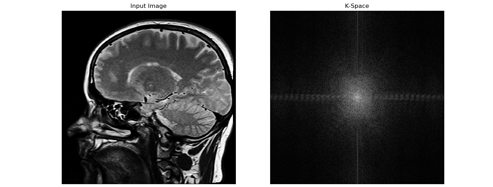
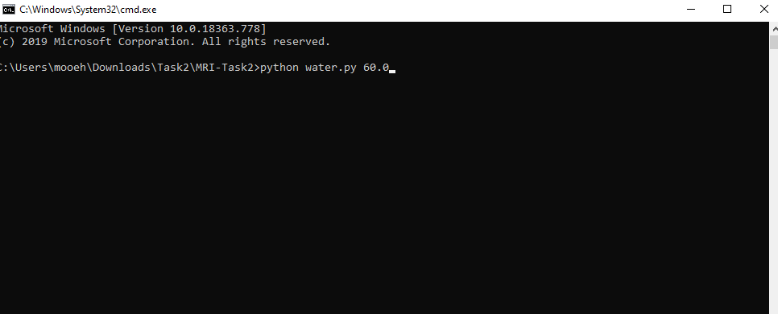
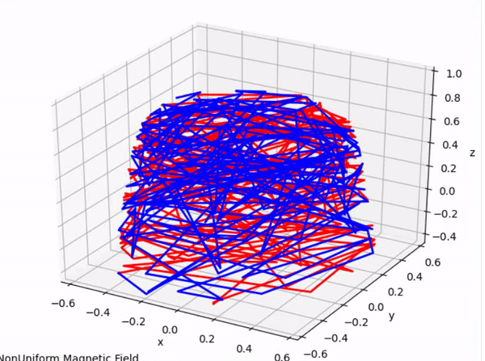
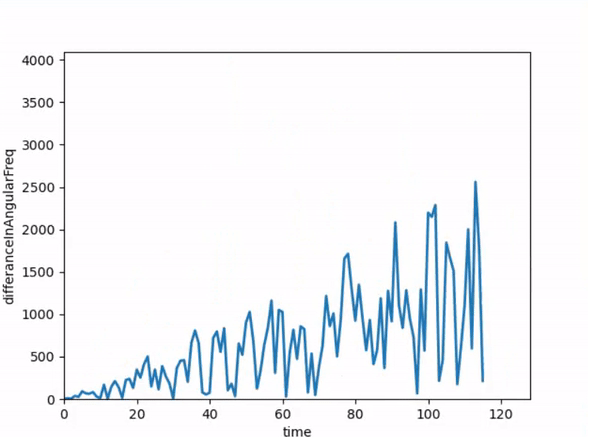

* # How to run the code
* ## Task 2 MRI

* # Abstract:
    In this report i will discuss how to run the code correctly.
* # What to write in the terminal:

   * ## To run The K-Space function on an image:
		* ## Run "kspace.py" file
			* ### Passing one more argument: -Path of the Image.
		(Screenshots/TerminalKspace.png)
   
    		
		* ## you will get result like this:
		

    * ## To run The Nonuniformity & Angular frequency Difference function:
		* ## Run "magnetic.py" file 
			* ### Passing 1 more arguments: 
				- 2)Flip angle Value. 
		
		
    	
	* ## you will get these two results:
		* ### Nonuniformity effect:
		
		* ### Angular Frequency Difference:
		

